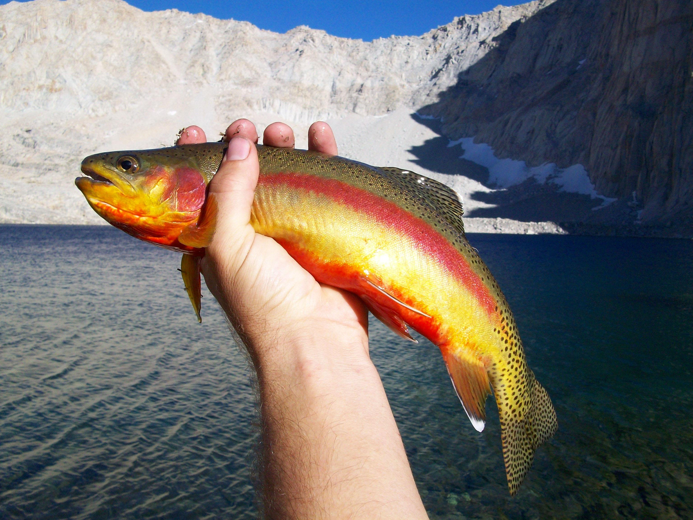
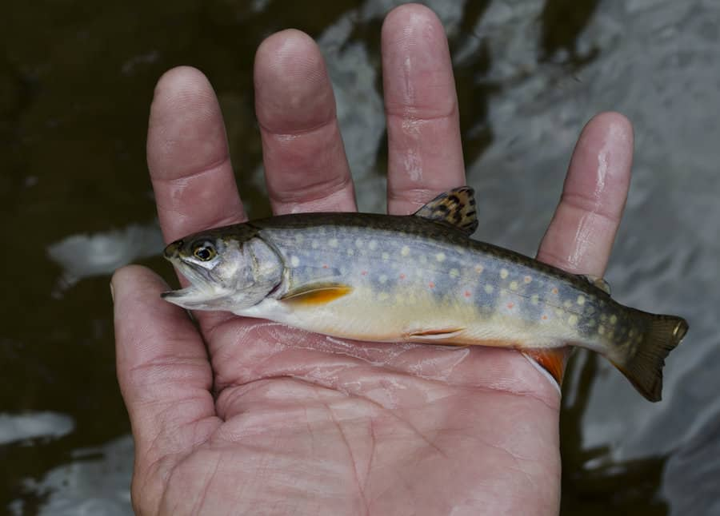
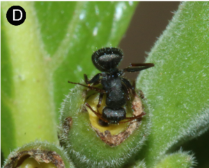

```{r setup}
library(ggplot2)
library(dplyr)
library(lme4)
library(lmerTest)
library(ggfortify)
library(MuMIn)
library(asbio)
library(GGally)
library(performance)
library(patchwork)
```

$~$

## Example 1: HML Growth 

$~$

I wanted to re-visit the high mountain lake dataset from Symons et al. 2019 in order to try and find a model that's able to explain differences in growth rates for each sampled trout during their first year of life. Such a model could potentially inform managers on which lakes to prioritize for stocking. 





$~$

<span style="color:black;font-size:30px">1.1 Data visualization and colinearity check</span>

```{r fish: data visualization}
fish <- read.csv("data/HMLgrowth(edited).csv") #Maybe have to remove fish with n.a. for growth?

ggplot(fish, aes(Species, grow.age.1, colour = Species)) + 
  geom_point(size=3, position = position_dodge2(width=.33, preserve = "total"))+ 
  xlab ("Species (Brook, Brown or Rainbow Trout)") +
  ylab ("Growth of Annuli Radius at Age 1 (cm)") + 
  labs(caption="Figure 1: Growth during the first year of life for individual trout grouped by species.") + 
  theme(plot.caption=element_text(size=11, hjust=0, margin=margin(15,0,0,0)))
```

I'm mostly interested in the powers of surface temperature, dissolved organic carbon, dissolved nitrogen, and the isotopic signatures of carbon and nitrogen in sampled fish tissues to explain first-year growth. The authors had clear biological reasons for considering these as important parameters. 

```{r fish: colinearity check}
ggpairs(fish, columns = 4:8) + theme_bw()
```

There are some fairly highly colinear relationships here (such as 0.570 between total nitrogen and surface temp), but I decided to wait to test for multicolinearity before I threw out any predictor variables.

$~$

<span style="color:black;font-size:30px">1.2 Model formation and multicolinearity check</span>

I formulated my model to explain the first-year growth with average annual surface temp (Celsius), concentration of dissolved carbon (mg/L), total nitrogen (mg/L), 13C and 15N isotopic tissue signatures as explanatory variables. 

```{r fish: first model for dredging}
fish_wash1 <- lm(grow.age.1 ~ surface.temp.c + doc.mgL + TN.mgL + fish.d13C + fish.d15N, data = fish)
anova(fish_wash1)
```

Based on the above ANOVA table we might expect suface temp and total nitrogen to be fairly important parameters. 

```{r fish: check for multicolinearity}
performance::check_collinearity(fish_wash1)
```

All IVF values below 5, no multicolinearity detected - we can keep our parameters for now.  

$~$

<span style="color:black;font-size:30px">1.3 Dredging</span>

```{r fish: dredging}
options(na.action = "na.fail") 
dredge_fish <- dredge(fish_wash1)
dredge_fish
```

Arbitrarily sub-setting for <2 AIC will give us 4 top models, but sub-setting for <2.5 delta AIC will give us 10 models w/ 6 that are nearly as important as our 4th most important. 

So, let's stick with within 2.5 AIC for now: 

```{r fish: sub-setting <2.5 AIC}
subset(dredge_fish, delta <2.5)
```

$~$

<span style="color:black;font-size:30px">1.4 Parameter importance and model averaging</span>

Next, let's look at the importance of the included parameters: 

```{r fish: parameter importance}
importance(dredge_fish)
```

Strong support for including total nitrogen and suface temperature in an explanation of first-year growth, with much lower support for the other 3 parameters. 

I decided to average my top 10 models as a sort of compromise between including all possible models and just those within the arbitrarily narrow 2 AIC score range. 

```{r fish: model averaging}
fish_topmods <- subset(dredge_fish, delta <2.5)

model.avg(fish_topmods, revised.var = TRUE)
```

```{r fish summary: average top 10 models}
summary(model.avg(fish_topmods))
```

$~$

<span style="color:black;font-size:30px">1.5 AIC table</span>

Now for a "publishable" table: 

```{r fish: AIC table}
fish.out.put <- model.sel(fish_topmods)
fish.out.put

str(fish.out.put)

fish.sel.table<-as.data.frame(fish.out.put)[7:11]
fish.sel.table

#rounding
fish.sel.table[,2:3]<- round(fish.sel.table[,2:3],2)
fish.sel.table[,4:5]<- round(fish.sel.table[,4:5],3)
fish.sel.table

#rename number of parameters
names(fish.sel.table)[1] = "K"

#put model names in a column
fish.sel.table$Model<-rownames(fish.sel.table)

#replace model names with their formulas #NOT SURE WHY THIS ISN'T WORKING
#for(i in 1:nrow(fish.sel.table)) fish.sel.table$Model[i] <- #as.character(formula(paste(fish.sel.table$Model[i])))[3]

#Arrange columns
fish.sel.table<-fish.sel.table[,c(6,1,2,3,4,5)]

fish.sel.table
```

$~$

<span style="color:black;font-size:30px">1.6 Parameter figures</span>

```{r fish: parameter figures for NPP and FRAG}
p1 <- ggplot(fish, aes(TN.mgL, grow.age.1, colour = TN.mgL)) + 
  geom_point() +
  geom_smooth(method="lm") +
  scale_x_continuous(limits = c(0, 0.6)) + 
  xlab ("Total Nitrogen (mg/L)") +
  ylab ("Year One Growth in Annuli Radius (cm)") 

p2 <- ggplot(fish, aes(surface.temp.c, grow.age.1, colour = surface.temp.c)) + 
  geom_point() +
  geom_smooth(method="lm") +
  scale_colour_gradientn(colours = terrain.colors(10, rev=TRUE)) +
  scale_x_continuous(limits = c(8, 21)) + 
  xlab ("Surface Temp (Celsius)") +
  ylab ("Year One Growth in Annuli Radius (cm)") 

p1+p2
```

$~$

## Example 2:

$~$

For my second example, I used data from Marvalhas and Vasconcelos 2019 looking at multiple environmental factors influencing ant diversity in the Brazilian Cerrado, a Neotropical savanna region. 


Left: *Camponotus crassus* 
$~$

<span style="color:black;font-size:30px">2.1 Colinearity check</span>

```{r ant: import dataset}
ant <- read.csv("data/ant_diversity.csv")

ggpairs(ant, columns = 14:21) + theme_bw()
```
$~$

Again here, there are some *VERY* highly colinear relationships (see DLC and SAND, -0.724). But I wanted to wait to test for multicolinearity before throwing any variables out.  

$~$

SAND is fairly colinear with DLC (-0.724), NPP (-0.608), and DLC and NPP are fairly colinear (0.516). Everything else looks **RELATIVELY** OK. 

$~$

<span style="color:black;font-size:30px">2.2 Model formation and multicolinearity check</span>

```{r ant: first model for dredging}
ant_wash1 <- lm(RSR_SS3 ~ RAIN + NPP + HDR + REF + HET + DLC + SAND + FRAG, data=ant)
anova(ant_wash1)
```

From the above ANOVA table, we might expect NPP (net primary productivity) and FRAG (the proportion of coarse rock fragments) to be the most important parameters. 

```{r ant: check for multicolinearity}
performance::check_collinearity(ant_wash1)
```

All VIF values less than 5, so don't need to throw out any variables just yet!

$~$

<span style="color:black;font-size:30px">2.3 Dredging and subsetting</span>

```{r dredging}
options(na.action = "na.fail") 
dredge_ant<-dredge(ant_wash1)
dredge_ant
```

There are 6 models that are within 2 AIC of each other. Let's subset those. 

```{r ant: subset best models}
subset(dredge_ant, delta <2)
```

Again, 6 models of relatively equal importance. 

Let's look at the most important variables. 

$~$

<span style="color:black;font-size:30px">2.4 Parameter importance and model averaging</span>

```{r ant: paramter importance}
importance(dredge_ant)
```

Strong support for NPP and FRAG, but much less for the other parameters. 

I decided to average my top 6 models to get adjusted estimates for the parameter coefficients. 

```{r ant: model averaging}
ant_topmods <- subset(dredge_ant, delta <2)

model.avg(ant_topmods, revised.var = TRUE)
```

```{r summary: average top 6 models}
summary(model.avg(ant_topmods))
```

$~$

<span style="color:black;font-size:30px">2.5 AIC Table</span>

Now for a "publishable" table: 

```{r ant: AIC table}
ant.out.put <- model.sel(ant_topmods)
ant.out.put

str(ant.out.put)

ant.sel.table<-as.data.frame(ant.out.put)[10:14]
ant.sel.table

#rounding
ant.sel.table[,2:3]<- round(ant.sel.table[,2:3],2)
ant.sel.table[,4:5]<- round(ant.sel.table[,4:5],3)
ant.sel.table

#rename number of parameters
names(ant.sel.table)[1] = "K"

#put model names in a column
ant.sel.table$Model<-rownames(ant.sel.table)

#replace model names with their formulas #NOT SURE WHY THIS ISN'T WORKING
#for(i in 1:nrow(ant.sel.table)) ant.sel.table$Model[i]<- #as.character(formula(paste(ant.sel.table$Model[i])))[3]

#Arrange columns
ant.sel.table<-ant.sel.table[,c(6,1,2,3,4,5)]

ant.sel.table
```

$~$

<span style="color:black;font-size:30px">2.6 Visualization of important parameters</span>

And "publishable" figures for the effects of our two most important predictors: 

```{r ant: parameter figures for NPP and FRAG}
p3 <- ggplot(ant, aes(NPP, RSR_SS3, colour = NPP)) + 
  geom_point() +
  geom_smooth(method="lm")+
  scale_x_continuous(limits = c(-2, 2)) + 
  xlab ("Net Primary Productivity (units?)") +
  ylab ("Rarified Species Richness")  

p4 <- ggplot(ant, aes(FRAG, RSR_SS3, colour = FRAG)) + 
  geom_point() +
  geom_smooth(method="lm") +
  scale_colour_gradientn(colours = terrain.colors(10, rev=TRUE)) +
  scale_x_continuous(limits = c(-1.5, 2.6)) +   
  xlab ("Proportion of Coarse Rock Fragments") +
  ylab ("Rarified Species Richness") 

p3+p4
```

